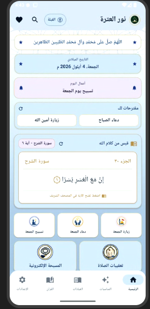
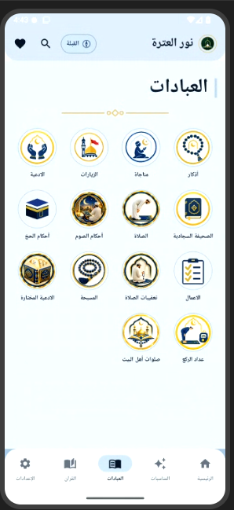
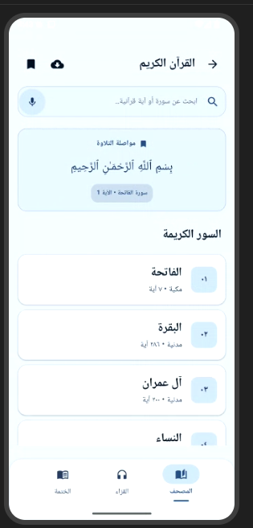
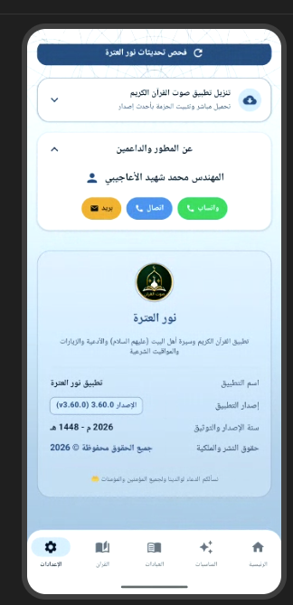

# 🕌 نور العترة | Noor Al-Atra

### تطبيق ديني شامل لخدمة القرآن الكريم والعبادات والأدعية

**نور العترة** هو تطبيق ديني عربي يهدف إلى توفير مجموعة من الخدمات والمحتويات الإسلامية في تطبيق واحد، ضمن واجهة حديثة وبسيطة وسهلة الاستخدام.

---

## 📱 عن التطبيق

**نور العترة** تطبيق ديني شامل صُمم ليكون رفيقًا للمستخدم في عباداته اليومية، من خلال تنظيم مجموعة من الأقسام والخدمات الدينية في واجهة واحدة واضحة وسهلة الوصول.

يهتم التطبيق بتقديم تجربة استخدام عربية حديثة، مع دعم اتجاه الكتابة من اليمين إلى اليسار (RTL)، وتصميم هادئ ومناسب للمحتوى الديني.

---

## ✨ أهم المميزات

### 📖 القرآن الكريم
- تصفح سور القرآن الكريم.
- قائمة منظمة للسور.
- البحث عن السور والآيات.
- عرض الآيات بطريقة واضحة ومريحة للقراءة.
- دعم الاستماع إلى التلاوة.
- واجهة مخصصة لقسم القرآن الكريم.

### 🕌 العبادات
يضم التطبيق مجموعة من أبواب العبادات والخدمات الدينية، ومنها:

- 🕋 أحكام الحج
- 🌙 أحكام الصوم
- 🕌 أحكام الصلاة
- 📿 التسبيح
- 🤲 الدعاء
- 📜 الزيارات
- 📋 الأعمال
- 🧭 عداد الركع
- وغيرها من الخدمات الدينية.

### 🤲 الأدعية والزيارات
يوفر التطبيق مجموعة من الأدعية والزيارات والنصوص الدينية بطريقة منظمة وسهلة القراءة.

### 📿 التسبيح الإلكتروني
عداد تسبيح إلكتروني يساعد المستخدم على متابعة عدد التسبيحات بسهولة.

### 🔔 التحديثات
يحتوي التطبيق على نظام لفحص تحديثات التطبيق وإعلام المستخدم عند توفر إصدار أحدث، مع عرض معلومات الإصدار من خلال الإعدادات.

---

## 🧭 أقسام التطبيق

| القسم | الوصف |
|---|---|
| 🏠 الرئيسية | الوصول السريع إلى أهم محتويات التطبيق |
| 📖 القرآن | قراءة وتصفح القرآن الكريم |
| 🕌 العبادات | مجموعة من أبواب العبادات |
| ✨ المناسبات | المحتوى والمناسبات الدينية |
| ⚙️ الإعدادات | التحكم بإعدادات التطبيق ومعلوماته |

---

## 🎨 التصميم

تم تصميم التطبيق ليجمع بين:

- واجهة عربية بالكامل.
- دعم RTL.
- تصميم عصري وبسيط.
- ألوان هادئة مناسبة للتطبيقات الدينية.
- بطاقات وأيقونات واضحة.
- سهولة التنقل بين الأقسام.
- تصميم مناسب للهواتف الذكية.

---

## 📸 لقطات من التطبيق

### الصفحة الرئيسية

### قسم العبادات

### القرآن الكريم

### الإعدادات ومعلومات التطبيق

---

## 🛠️ التقنيات المستخدمة

- **Flutter**
- **Dart**
- **Material Design**
- **Arabic RTL**
- **Local Storage**
- **Audio Support**
- **GitHub Releases / Updates**

---

## 📦 معلومات الإصدار

| المعلومة | التفاصيل |
|---|---|
| اسم التطبيق | نور العترة |
| الاسم بالإنجليزية | Noor Al-Atra |
| الإصدار | v3.60.0 |
| المنصة | Android |
| اللغة | العربية |
| سنة الإصدار | 2026 |

---

## 👨‍💻 التصميم والتطوير

### المهندس محمد شهيد الاعجيبي

**مصمم ومطور تطبيق نور العترة**

تم تصميم واجهة التطبيق وتجربة المستخدم بهدف تقديم تطبيق ديني بسيط، حديث وسهل الاستخدام.

---

## 🎯 هدف المشروع

يهدف مشروع **نور العترة** إلى جمع مجموعة من الخدمات والمحتويات الدينية في تطبيق واحد، وتقديمها للمستخدم بطريقة منظمة وحديثة تساعده على الوصول إلى القرآن الكريم والعبادات والأدعية والزيارات والمحتوى الإسلامي بسهولة.

---

## ❤️ رسالة المشروع

> نسعى إلى تقديم محتوى ديني نافع بواجهة عصرية وسهلة الاستخدام، ليكون تطبيق نور العترة رفيقًا للمستخدم في عباداته وقراءته اليومية.

---

## 📄 حقوق المشروع

جميع الحقوق محفوظة.

**© 2026 نور العترة**  
**© المهندس محمد شهيد الاعجيبي**
